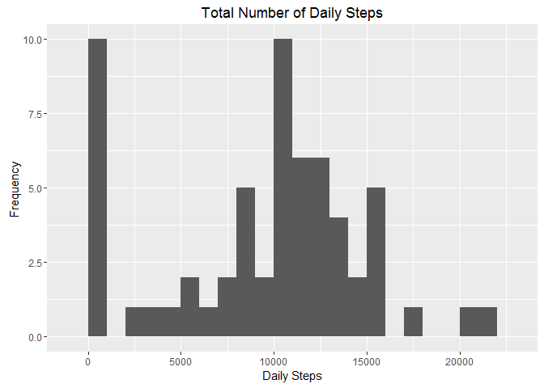
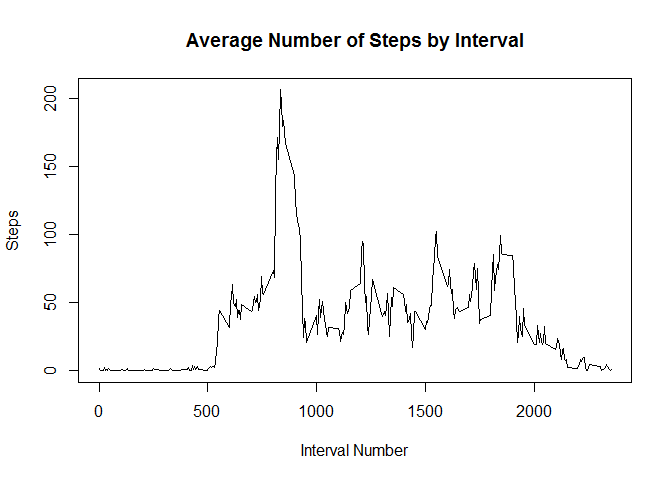
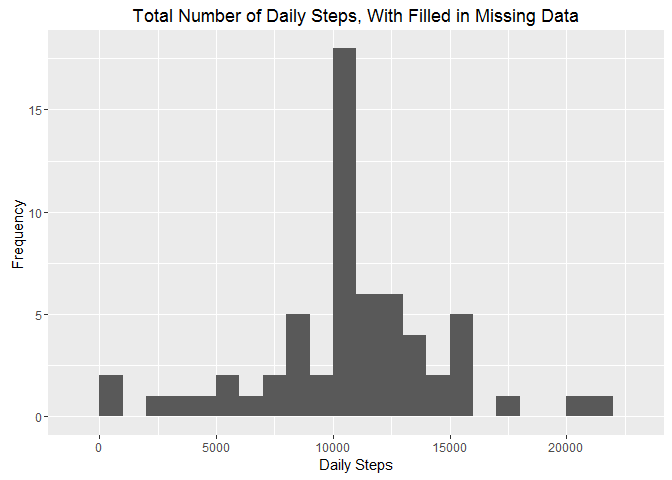

# Analyzing Activity Monitoring Data
Angela McElroy  
January 11, 2016  

### **Introduction:**
This project is for the *Reproducible Research* course on Coursera.

The purpose of this project was to use existing data from an activity monitoring device worn by an individual to answer questions about their activity. This data was collected over a two month period and is seperated into 5 minute intervals. The dataset consists of steps taken, date, and interval (5 mins). 

### **Loading and Processing the Data**

First, make sure you have saved the dataset into your working directory. You can get the [Activity monitoring data](https://d396qusza40orc.cloudfront.net/repdata%2Fdata%2Factivity.zip) here.

Then we need to unzip and load our data. Remeber that the data is stored as a CSV, which means the data is separated by commas, and that the data has a header. 


```r
unzip("repdata-data-activity.zip")
cls = c("integer", "character", "integer")
activitydata <- read.csv ("activity.csv", head=TRUE, colClasses=cls, na.strings="NA")
```
### **Let's Analyze our data!**

#### What is mean total number of steps taken per day? 
We are going to ignore the missing values and: 

1. Calculate the total number of steps taken per day, 
2. Make a histogram of the total number of steps taken each day, 


```r
library(ggplot2)
```

```
## Warning: package 'ggplot2' was built under R version 3.2.3
```

```r
stepsSUM <- tapply(activitydata$steps, activitydata$date, FUN = sum, na.rm = TRUE)
qplot(stepsSUM, binwidth = 1000, main= "Total Number of Daily Steps", xlab= "Daily Steps", ylab= "Frequency ")
```

\

3. Calculate and report the mean and median of the total number of steps taken per day. 


```r
mean(stepsSUM)
```

```
## [1] 9354.23
```

```r
median(stepsSUM)
```

```
## [1] 10395
```

The mean for this dataset is 9,354.23 and the median is 10,395.


#### What is the average daily activity pattern?
We need to:

1. Make a time series plot (i.e. type = "l") of the 5-minute interval (x-axis) and the average number of steps taken, averaged across all days (y-axis).


```r
intervalavg <- tapply(activitydata$steps, activitydata$interval, mean, na.rm=TRUE, simplify=T)
activitydata_intervalavg <- data.frame(interval=as.integer(names(intervalavg)), avg=intervalavg)

with(activitydata_intervalavg,
     plot(interval,
          avg,
          type="l",
          main ="Average Number of Steps by Interval",
          xlab="Interval Number",
          ylab="Steps"))
```

\

2. Which 5-minute interval, on average across all the days in the dataset, contains the maximum number of steps?


```r
max_steps <- max(activitydata_intervalavg$avg)
activitydata_intervalavg[activitydata_intervalavg$avg == max_steps, ]
```

```
##     interval      avg
## 835      835 206.1698
```

#### Imputing missing values
Note that there are a number of days/intervals where there are missing values (coded as NA). The presence of missing days may introduce bias into some calculations or summaries of the data.
Calculate and report the total number of missing values in the dataset (i.e. the total number of rows with NAs). 


```r
sum(is.na(activitydata$steps))
```

```
## [1] 2304
```

1. Devise a strategy for filling in all of the missing values in the dataset. The strategy does not need to be sophisticated. For example, you could use the mean/median for that day, or the mean for that 5-minute interval, etc.Create a new dataset that is equal to the original dataset but with the missing data filled in.


```r
datafilled <- activitydata
nas <- is.na(datafilled$steps)
avg_int <- tapply(datafilled$steps, datafilled$interval, mean, na.rm=TRUE, simplify=TRUE)
datafilled$steps[nas] <- avg_int[as.character(datafilled$interval[nas])]
```

This replaces all the misisng values with the mean. Let's check for missing values again:


```r
sum(is.na(datafilled$steps))
```

```
## [1] 0
```

2. Make a histogram of the total number of steps taken each day and Calculate and report the mean and median total number of steps taken per day.


```r
library(ggplot2)
newstepsSUM <- tapply(datafilled$steps, datafilled$date, sum, na.rm = TRUE)
qplot(newstepsSUM, binwidth = 1000, main= "Total Number of Daily Steps, With Filled in Missing Data", xlab= "Daily Steps", ylab= "Frequency ")
```

\


```r
mean(newstepsSUM)
```

```
## [1] 10766.19
```

```r
median(newstepsSUM)
```

```
## [1] 10766.19
```

3. Do these values differ from the estimates from the first part of the assignment? What is the impact of imputing missing data on the estimates of the total daily number of steps?

During the first part of the assignment the mean for this dataset was 9,354.23 and the median was 10,395.After replacing the missing values with the mean, the new mean is 10,766.19 and the new median is 10,766.19. Now, the mean and the median are equal, but the values are higher than the original data. One explanation could be that the missing values were calculated as zeros, thus bringing down the mean and median averages. 

#### Are there differences in activity patterns between weekdays and weekends?

1. Create a new factor variable in the dataset with two levels - "weekday" and "weekend" indicating whether a given date is a weekday or weekend day.


```r
dayofweek <- function(date) {
    day <- weekdays(date)
    if (day %in% c("Monday", "Tuesday", "Wednesday", "Thursday", "Friday")) 
        return("weekday") else if (day %in% c("Saturday", "Sunday")) 
        return("weekend") else stop("invalid date")
}
datafilled$date <- as.Date(datafilled$date)
datafilled$day <- sapply(datafilled$date, FUN = dayofweek)
```

2. Make a panel plot containing a time series plot (i.e. type = "l") of the 5-minute interval (x-axis) and the average number of steps taken, averaged across all weekday days or weekend days (y-axis).


